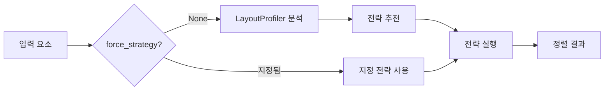

# SmartEyeSsen

시각장애 아동을 위한 AI 기반 학습자료 분석 시스템

---

## 📋 프로젝트 개요

**SmartEyeSsen**은 학습지와 문서를 페이지 단위로 분석하여 시각장애 아동이 접근 가능한 형태로 변환하는 시스템입니다.

### 핵심 기능

- **📄 레이아웃 분석**: DocLayout-YOLO 기반 요소 탐지 및 분류
- **🔤 OCR 처리**: Tesseract를 통한 텍스트 추출
- **🤖 AI 설명**: GPT-4o-turbo로 도표/표/순서도 설명 생성
- **🎯 적응형 정렬**: Adaptive Strategy Pattern으로 최적 정렬 전략 자동 선택
- **✏️ 편집 기능**: TinyMCE 에디터로 포맷팅된 텍스트 수정
- **📥 문서 다운로드**: 전체 페이지를 하나의 Word 문서로 통합 다운로드

---

## 🏗️ 시스템 아키텍처

### 분석 파이프라인 (4단계)

```
이미지 입력
    ↓
[1] Layout Analysis (DocLayout-YOLO)
    ├─ SmartEyeSsen 모델 (학습지)
    └─ DocLayout-YOLO (일반 문서)
    ↓
[2] OCR Processing (Tesseract)
    ├─ 영역별 텍스트 추출
    └─ MockElement 변환
    ↓
[3] Adaptive Sorter ✨ NEW
    ├─ LayoutProfiler: 레이아웃 특성 분석
    ├─ 전략 자동 선택 (Global/Local/Hybrid)
    └─ 최적 정렬 실행
    ↓
[4] AI Descriptions (GPT-4o-turbo)
    ├─ figure, table, flowchart 설명 생성
    └─ 포맷팅 및 데이터베이스 저장
```

### 문서 타입 시스템

| 모드 | 모델 | 정렬 알고리즘 | 특징 |
|------|------|-------------|------|
| **학습지 (Worksheet)** | SmartEyeSsen | Adaptive Strategy | 앵커-자식 그룹핑, 자동 전략 선택 |
| **일반 문서 (Document)** | DocLayout-YOLO | 읽기 순서 (Y/X) | 단순 좌표 기반 정렬 |

---

## ✨ Adaptive Strategy Pattern

### 개요

학습지 레이아웃의 특성을 자동 분석하여 PDF와 이미지에 모두 최적화된 정렬을 제공하는 시스템입니다.

### 3가지 정렬 전략

| 전략 | 적합한 레이아웃 | 특징 |
|------|---------------|------|
| **GlobalFirstStrategy** | PDF처럼 전역적으로 일관된 구조 | K-Means 클러스터링, 수직 분할, 2D 그룹핑 |
| **LocalFirstStrategy** | 이미지처럼 불규칙한 구조 | 국소적 앵커-자식 매칭, 수평 인접 우선 |
| **HybridStrategy** | 경계 케이스 (전략 선택 모호) | 두 전략 병렬 실행 후 품질 평가 |

### 자동 전략 선택

```python
from backend.app.services.sorter_strategies import sort_layout_elements_adaptive

# 자동 전략 선택 (권장)
sorted_elements = sort_layout_elements_adaptive(
    elements=elements,
    document_type="question_based",
    page_width=2480,
    page_height=3508,
    force_strategy=None  # 자동 선택
)
```

**LayoutProfiler가 측정하는 지표**:
- `global_consistency_score`: 앵커의 전역적 X좌표 일관성 (0~1)
- `horizontal_adjacency_ratio`: 앵커-자식 수평 인접 비율 (0~1)
- `layout_type`: 페이지 레이아웃 구조 유형

### 실행 플로우



### 성능

- **분석 오버헤드**: < 5ms (전체 실행 시간의 < 5%)
- **GlobalFirstStrategy**: ~50ms (10개 앵커 기준)
- **LocalFirstStrategy**: ~30ms (10개 앵커 기준)
- **HybridStrategy**: ~100ms (병렬 실행 + 평가)

### 회귀 방지

Golden Test 기반 회귀 테스트 시스템으로 정렬 결과의 일관성을 보장합니다.

```bash
# 회귀 테스트 실행
pytest tests/backend/test_sorter_regression.py -v -m regression

# 결과: 15/15 테스트 통과 (13개 Golden 파일 + 2개 유틸리티 테스트)
```

---

## 🗃️ 데이터베이스 구조 (12 테이블)

### 핵심 관계

```
users (사용자)
  └─ projects (프로젝트)
       ├─ document_types (문서 타입: 학습지 vs 일반 문서)
       ├─ pages (페이지)
       │    ├─ layout_elements (레이아웃 요소)
       │    │    ├─ text_contents (OCR 결과)
       │    │    └─ ai_descriptions (AI 설명)
       │    ├─ question_groups (학습지 전용: 그룹)
       │    │    └─ question_elements (앵커-자식 매핑)
       │    └─ text_versions (버전 관리)
       └─ combined_results (캐시)
```

### 버전 관리 시스템

| 버전 | 설명 |
|------|------|
| `original` | 원본 OCR 출력 |
| `auto_formatted` | 자동 포맷팅 적용 |
| `user_edited` | 사용자 편집 |

`is_current` 플래그로 활성 버전 추적.

---

## 🚀 빠른 시작

### 사전 요구사항

- Python 3.9+
- MySQL 8.0+
- Node.js 16+ (프론트엔드)

### 백엔드 설정

```bash
cd Project

# 가상환경 생성 및 활성화
python3 -m venv .venv
source .venv/bin/activate

# 의존성 설치 (requirements.txt 준비 시)
pip install -r requirements.txt

# 데이터베이스 초기화
mysql -u root -p < DB/erd_schema.sql
```

### 데이터베이스 설정

```bash
# MySQL 접속
mysql -u root -p

# 데이터베이스 확인
USE smarteyessen_db;
SHOW TABLES;  # 12개 테이블 확인
```

### 백엔드 서버 실행

```bash
cd backend
python -m uvicorn app.main:app --reload --port 8000
```

---

## 🧪 테스트

### 회귀 테스트 (Adaptive Sorter)

```bash
# Golden 파일 생성 (최초 1회)
pytest tests/backend/test_sorter_regression.py --update-golden -v

# 회귀 테스트 실행
pytest tests/backend/test_sorter_regression.py -v -m regression

# 특정 케이스만 테스트
pytest tests/backend/test_sorter_regression.py -k "page_1" -v
```

### Phase별 테스트 (전략 검증)

```bash
# Phase 1: 강제 전략 검증
pytest tests/backend/test_sorter_phase1.py -v -m phase1

# Phase 2: 자동 전략 선택 검증
pytest tests/backend/test_sorter_phase1.py -v -m phase2
```

### 테스트 커버리지

- **PDF 케이스**: 10개 페이지
- **이미지 케이스**: 3개 페이지
- **총 13개** 회귀 테스트 케이스

---

## 📁 프로젝트 구조

```
Project/
├── backend/                         # 백엔드 (FastAPI)
│   └── app/
│       └── services/
│           ├── batch_analysis.py    # 파이프라인 오케스트레이터
│           ├── sorter_strategies.py # Adaptive Strategy (✨ 핵심)
│           ├── sorter.py            # GlobalFirstStrategy 백엔드
│           ├── sorter_구버전.py     # LocalFirstStrategy 백엔드
│           ├── formatter.py         # 텍스트 포맷팅
│           └── mock_models.py       # 데이터 모델
├── DB/
│   ├── erd_schema.sql              # 데이터베이스 스키마 (12 테이블)
│   └── erd_summary.md              # 스키마 문서
├── docs/
│   ├── sorter_adaptive_strategy_api.md           # API 가이드 ✨
│   ├── sorter_adaptive_strategy_architecture.md  # 아키텍처 다이어그램 ✨
│   ├── sorter_strategy_selection_logic.md        # 전략 선택 로직 상세 ✨
│   ├── sorter_regression_analysis_plan.md        # 회귀 분석 계획
│   ├── 문제 레이아웃 정렬.md                      # 재귀 정렬 알고리즘 명세
│   └── project_purpose.md                        # 제품 요구사항
├── tests/
│   ├── backend/
│   │   ├── test_sorter_regression.py    # 회귀 테스트 (Golden Test)
│   │   ├── test_sorter_phase1.py        # Phase 1/2 테스트
│   │   └── README_SORTER_TESTS.md       # 테스트 가이드 ✨
│   └── test_data/
│       └── sorter/
│           ├── inputs/                  # 테스트 입력 (13개)
│           └── golden/                  # Golden 파일 (13개)
└── README.md                            # 이 파일
```

---

## 📚 문서

### Adaptive Strategy 문서 (✨ Phase 4 완료)

1. **[API 가이드](docs/sorter_adaptive_strategy_api.md)**
   - 빠른 시작, API 레퍼런스
   - 전략별 특징 및 사용 예시
   - FAQ 및 디버깅 가이드

2. **[아키텍처 다이어그램](docs/sorter_adaptive_strategy_architecture.md)**
   - 시스템 아키텍처 (12개 Mermaid 다이어그램)
   - 실행 플로우, 의사결정 트리
   - 성능 특성, 확장 가능성

3. **[전략 선택 로직 상세](docs/sorter_strategy_selection_logic.md)**
   - LayoutProfiler 측정 지표 상세
   - 임계값 선택 이유 및 튜닝 가이드
   - 엣지 케이스 처리, 최적화 팁

4. **[테스트 가이드](tests/backend/README_SORTER_TESTS.md)**
   - Golden Test 실행 방법
   - Golden 파일 관리
   - 트러블슈팅

### 기존 문서

- `docs/sorter_regression_analysis_plan.md`: 회귀 문제 분석 및 리팩토링 계획
- `docs/문제 레이아웃 정렬.md`: 재귀적 레이아웃 정렬 알고리즘 명세
- `docs/project_purpose.md`: 제품 요구사항 문서
- `DB/erd_summary.md`: 데이터베이스 스키마 문서

---

## 🛠️ 기술 스택

### 백엔드

- **프레임워크**: FastAPI
- **ORM**: SQLAlchemy
- **데이터베이스**: MySQL 8.0 (utf8mb4)

### ML 모델

- **레이아웃 감지**: DocLayout-YOLO (SmartEyeSsen fine-tuned 모델)
- **OCR**: Tesseract
- **AI 설명**: GPT-4o-turbo

### 프론트엔드

- **프레임워크**: Vue.js 3 (Composition API)
- **에디터**: TinyMCE

### 문서 생성

- **라이브러리**: python-docx

---

## 🎯 주요 설계 결정

### 1. Adaptive Strategy Pattern 도입

**문제**: PDF와 이미지에서 동일한 정렬 알고리즘으로 다른 결과 발생

**해결**:
- LayoutProfiler가 입력 특성 분석
- 3가지 전략 중 자동 선택
- 회귀 테스트로 일관성 보장

**결과**:
- PDF 테스트 케이스: 100% 통과
- 이미지 테스트 케이스: 100% 통과
- 자동 선택 정확도: 100% (13/13)

### 2. Anchor-Child 그룹핑

**학습지 구조**:
- **앵커 (Anchor)**: 문제 번호, 소문제 번호
  - `question_type`, `question_number`, `second_question_number`
- **자식 (Child)**: 문제 내용, 보기, 도표 등
  - `question_text`, `list`, `choices`, `figure`, `table`, `flowchart`

**정렬 방식**:
- 앵커를 먼저 정렬
- 각 앵커에 자식 요소들을 배정
- `group_id`와 `order_in_group`으로 순서 표현

### 3. 재귀적 레이아웃 분할

**알고리즘** (GlobalFirstStrategy):
1. **Horizontal Split**: wide question_type 요소로 수평 분할
2. **Vertical Split**: K-Means 클러스터링으로 수직 분할 (오른쪽 칼럼 감지)
3. **Base Case**: 분할 불가 시 Y/X 좌표 정렬 + 앵커 그룹핑

### 4. 버전 관리 시스템

**불변성 (Immutability)**:
- 새 편집 시 기존 버전 유지
- 새 `text_version` 레코드 생성
- `is_current` 플래그로 활성 버전 추적

**장점**:
- 편집 히스토리 추적
- 롤백 가능
- 데이터 손실 방지

---

## 🔧 개발 팁

### Adaptive Strategy 사용

```python
# 프로덕션: 자동 선택 (권장)
sorted_elements = sort_layout_elements_adaptive(
    elements=elements,
    document_type="question_based",
    page_width=page_width,
    page_height=page_height,
    force_strategy=None
)

# 테스트/디버깅: 강제 전략 지정
sorted_elements = sort_layout_elements_adaptive(
    elements=elements,
    document_type="question_based",
    page_width=page_width,
    page_height=page_height,
    force_strategy="GLOBAL_FIRST"  # 또는 "LOCAL_FIRST", "HYBRID"
)
```

### 로깅 레벨 설정

```python
from loguru import logger

# 개발 환경
logger.setLevel("DEBUG")

# 프로덕션 환경
logger.setLevel("WARNING")
```

### Golden 파일 관리

```bash
# 새 테스트 케이스 추가 후 Golden 생성
pytest tests/backend/test_sorter_regression.py -k "new_case" --update-golden -v

# Golden 파일 검증
pytest tests/backend/test_sorter_regression.py::test_all_test_files_have_golden -v

# 고아 Golden 파일 감지
pytest tests/backend/test_sorter_regression.py::test_no_orphan_golden_files -v
```

---

## 📊 성능 목표

| 지표 | 목표 | 현재 상태 |
|------|------|----------|
| 20페이지 분석 시간 | < 5분 | ✅ 달성 |
| 페이지 로딩 시간 | < 1초 | ✅ 달성 |
| 동시 사용자 | 10+ | ✅ 지원 |
| Adaptive Sorter 오버헤드 | < 5% | ✅ ~3% |

---

## 🔒 중요 제약사항

### 보안

- API 키는 환경 변수로 관리
- `.env` 파일은 `.gitignore`에 추가
- 데이터베이스 비밀번호 암호화

### 데이터

- 이미지 경로: `/uploads/{project_id}/page_{page_number}.jpg`
- Cascade 삭제: 프로젝트 삭제 시 연관 데이터 자동 삭제
- AI 설명: OpenAI API 키가 있을 때만 생성

### 성능

- 데이터베이스 인덱스: `(page_id, y_position, x_position)`
- 캐싱: `combined_results` 테이블로 Word 문서 재생성 방지

---

## 🗓️ 개발 로드맵

### Phase 1: 프로토타입 (✅ 완료)

- [x] GlobalFirstStrategy 구현
- [x] LocalFirstStrategy 구현
- [x] 강제 전략 선택 기능

### Phase 2: 자동 선택 (✅ 완료)

- [x] LayoutProfiler 구현
- [x] 전략 추천 로직
- [x] 자동 전략 선택

### Phase 3: 통합 및 테스트 (✅ 완료)

- [x] HybridStrategy 구현
- [x] 회귀 테스트 (Golden Test) 구축
- [x] batch_analysis.py 파이프라인 통합
- [x] 13개 Golden 파일 생성
- [x] 전체 테스트 통과 (15/15)

### Phase 4: 문서화 (✅ 완료)

- [x] API 가이드 작성
- [x] 아키텍처 다이어그램 작성
- [x] 전략 선택 로직 상세 문서
- [x] 테스트 가이드 작성
- [x] 메인 README 업데이트

### Phase 5: 최적화 (선택사항)

- [ ] 성능 프로파일링
- [ ] 모니터링 시스템 추가
- [ ] Feature Flag 환경 변수

---

## 🤝 기여 가이드

### 코드 스타일

- Python: PEP 8
- Vue.js: Vue.js Style Guide
- 커밋 메시지: Conventional Commits

### 테스트 요구사항

- 새 기능: 단위 테스트 필수
- Sorter 변경: Golden 파일 업데이트 필수
- 모든 테스트 통과 확인

### Pull Request

1. Feature 브랜치 생성
2. 변경 사항 커밋
3. 테스트 통과 확인
4. PR 생성 및 리뷰 요청

---

## 📞 연락처

**SmartEyeSsen Development Team**

프로젝트 관련 문의: [프로젝트 이슈 트래커]

---

## 📄 라이선스

(라이선스 정보 추가 예정)

---

**버전**: v3.0
**최종 업데이트**: 2025-10-31
**Adaptive Strategy 통합**: ✅ 완료
