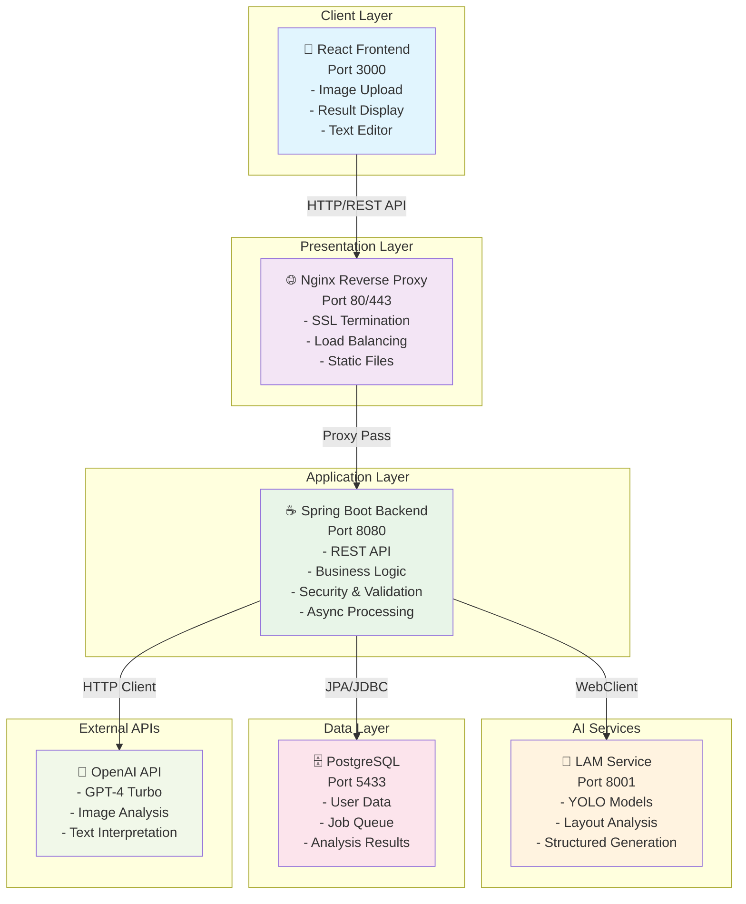
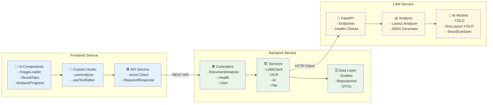
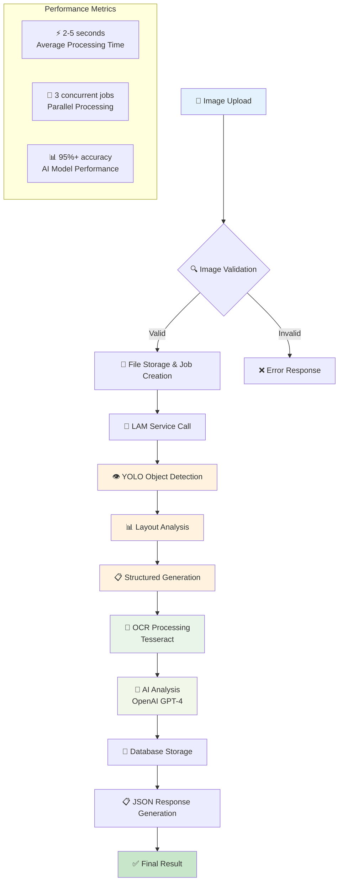
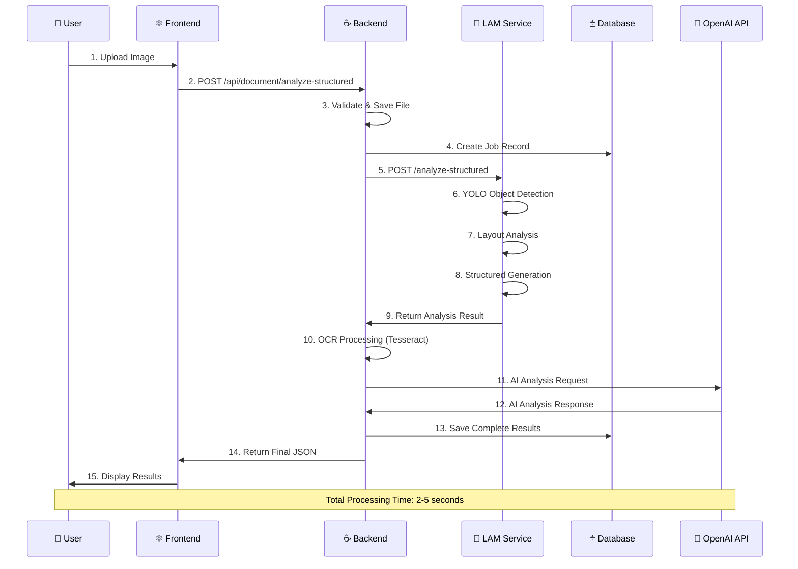
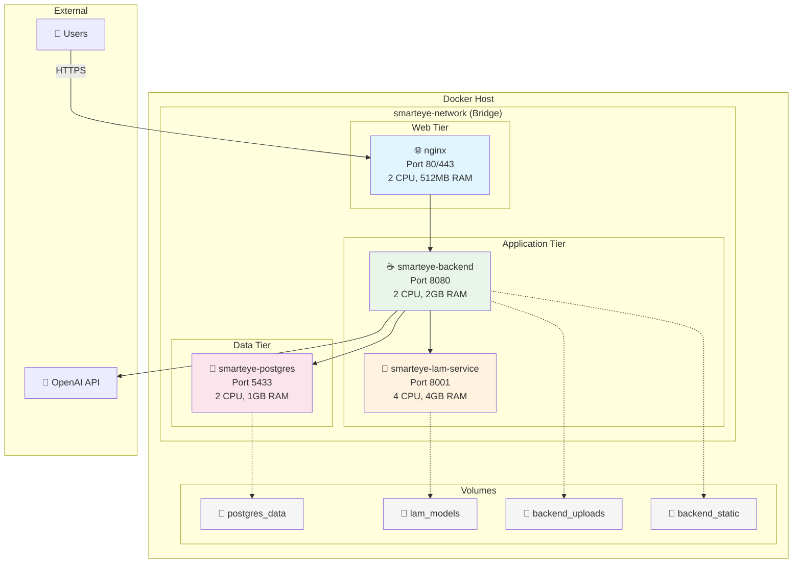
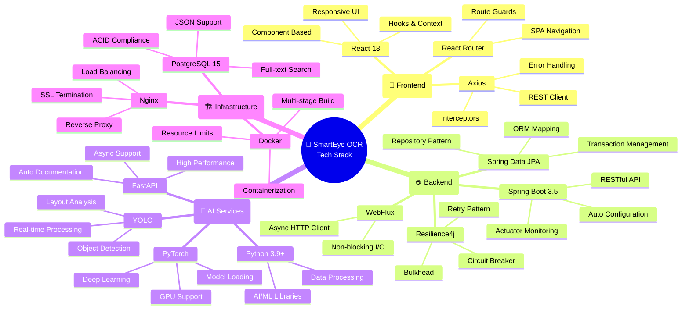
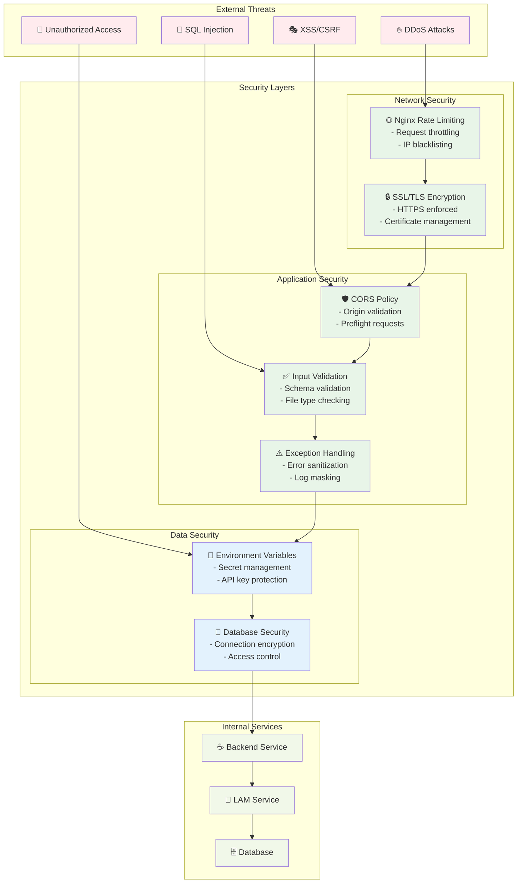
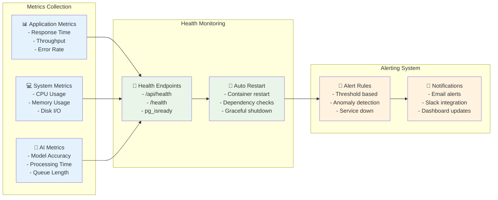

# 🏗️ SmartEye OCR 아키텍처 다이어그램

## Mermaid 다이어그램 (PPT에 삽입 가능)

---

## 1. 전체 시스템 아키텍처

---

## 2. 마이크로서비스 상세 구조

---

## 3. AI 분석 파이프라인

---

## 4. 데이터 흐름 다이어그램

---

## 5. Docker 배포 아키텍처

---

## 6. 기술 스택 구성도

---

## 7. 보안 아키텍처

---

## 8. 성능 모니터링 대시보드

---

## 사용법

### PowerPoint에서 사용하기

1. **Mermaid Live Editor** (https://mermaid.live) 방문
2. 위의 다이어그램 코드 복사하여 붙여넣기
3. **PNG/SVG로 내보내기**
4. PowerPoint에 이미지로 삽입

### Markdown 문서에서 사용하기

- GitHub, GitLab에서 자동 렌더링
- VSCode Mermaid 확장프로그램 사용
- Notion, Obsidian 등에서 지원

### 온라인 도구

- **Mermaid Live**: https://mermaid.live
- **Diagrams.net**: https://app.diagrams.net
- **Lucidchart**: Mermaid 임포트 지원
