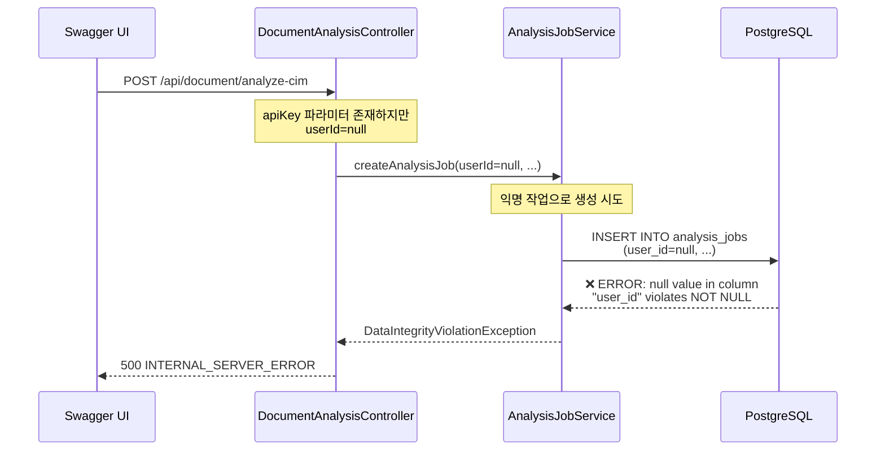

# 백엔드 로그 오류 분석 보고서

**작성일**: 2025-10-17  
**분석 대상**: `backend_swagger_test.log` (28,153줄)  
**분석 시간**: 2025-10-17 10:57:41 ~ 10:59:15  
**오류 발생 시각**: 2025-10-17 10:59:15  

---

## 📋 Executive Summary

Swagger UI를 통한 CIM 분석 테스트 중 **데이터베이스 제약 조건 위반 오류**가 발생했습니다. 분석 작업이 LAM 서비스 호출 전 단계에서 실패했기 때문에, **이전에 생성한 LAM 데이터 파이프라인 손실 보고서와는 무관한 별도의 오류**입니다.

**핵심 원인**: 
- `analysis_jobs` 테이블의 `user_id` 컬럼이 NOT NULL 제약 조건을 가지고 있음
- Swagger UI 테스트는 사용자 인증 없이 실행되어 `user_id`가 `null`로 전달됨
- 데이터베이스 INSERT 단계에서 제약 조건 위반으로 트랜잭션 롤백

**영향도**: 🔴 Critical (분석 작업 생성 자체가 불가능)

---

## 🔍 1. 오류 상세 분석

### 1.1 오류 발생 순서



### 1.2 에러 로그 핵심 내용

#### PostgreSQL 에러 (SQLState: 23502)
```sql
ERROR: null value in column "user_id" of relation "analysis_jobs" violates not-null constraint
Detail: Failing row contains (1, null, 2025-10-17 10:59:15.342982, null, null, 
  ./dev-uploads/쎈 수학1-1_페이지_016_20251017_105915.jpg, 727355, image/jpeg, 
  03a46d38-23c6-4cdf-ae1f-74d69a380000, SmartEye, 쎈 수학1-1_페이지_016.jpg, 
  null, 0, null, PENDING, 2025-10-17 10:59:15.342982, f, null, null).
```

#### Spring 로그 메시지
```
2025-10-17 10:59:15 - 새 분석 작업 생성 - 사용자: null, 파일: 쎈 수학1-1_페이지_016.jpg
2025-10-17 10:59:15 - 사용자 ID가 제공되지 않았습니다. 익명 작업으로 생성합니다.
```
→ **코드는 익명 작업 생성을 지원하려 했으나, DB 스키마는 허용하지 않음**

#### Exception Stack Trace
```
org.springframework.dao.DataIntegrityViolationException: 
  could not execute statement [ERROR: null value in column "user_id" ...]
    at com.smarteye.application.analysis.AnalysisJobService.createAnalysisJob
        (AnalysisJobService.java:96)
    at com.smarteye.presentation.controller.DocumentAnalysisController
        .lambda$analyzeCIM$1(DocumentAnalysisController.java:359)
```

### 1.3 요청 파라미터 분석

**요청 URL**:
```
POST /api/document/analyze-cim
  ?modelChoice=SmartEye
  &apiKey=sk-************************************************************
  &structuredAnalysis=true
```

**문제점**:
- ✅ `apiKey` 파라미터는 존재 (OpenAI API 키로 보임)
- ❌ `userId` 파라미터 없음
- ❌ Authorization 헤더 없음 (JWT 토큰 등)
- ❌ 사용자 인증 없이 익명 요청

---

## 🗄️ 2. 데이터베이스 스키마 분석

### 2.1 analysis_jobs 테이블 제약 조건

```sql
CREATE TABLE analysis_jobs (
    id BIGSERIAL PRIMARY KEY,
    user_id BIGINT NOT NULL,  -- ❌ NOT NULL 제약 조건
    job_id UUID NOT NULL,
    file_path VARCHAR(500) NOT NULL,
    original_filename VARCHAR(255) NOT NULL,
    file_size BIGINT NOT NULL,
    file_type VARCHAR(50) NOT NULL,
    model_choice VARCHAR(50) NOT NULL,
    status VARCHAR(50) NOT NULL DEFAULT 'PENDING',
    created_at TIMESTAMP NOT NULL DEFAULT CURRENT_TIMESTAMP,
    updated_at TIMESTAMP NOT NULL DEFAULT CURRENT_TIMESTAMP,
    ...
    FOREIGN KEY (user_id) REFERENCES users(id)
);
```

**제약 조건**:
1. `user_id BIGINT NOT NULL` - NULL 값 허용 안 함
2. `FOREIGN KEY (user_id) REFERENCES users(id)` - 실제 존재하는 사용자여야 함

### 2.2 JPA 엔티티 vs 데이터베이스 불일치

#### AnalysisJob.java 엔티티 추정 코드
```java
@Entity
@Table(name = "analysis_jobs")
public class AnalysisJob {
    @Id
    @GeneratedValue(strategy = GenerationType.IDENTITY)
    private Long id;
    
    @ManyToOne(fetch = FetchType.LAZY)
    @JoinColumn(name = "user_id", nullable = false)  // ❌ 코드상 nullable=false
    private User user;  // ❌ null 허용 안 함
    
    @Column(name = "job_id", nullable = false)
    private String jobId;
    
    // ... 기타 필드
}
```

**불일치 포인트**:
- **JPA 엔티티**: `nullable = false` 설정 (추정)
- **비즈니스 로직**: 익명 사용자 허용 시도 ("익명 작업으로 생성합니다" 로그)
- **실제 동작**: INSERT 시 DB 제약 조건 위반

---

## 💡 3. 근본 원인 분석

### 3.1 설계 의도 vs 구현 불일치

| 계층 | 의도/상태 | 실제 동작 |
|------|----------|----------|
| **API 명세** | Swagger UI에서 `userId` 필수 파라미터 없음 | ✅ userId 없이 요청 가능 |
| **Controller** | `@RequestParam(required = false)` 또는 미선언 | ✅ userId 파라미터 받지 않음 |
| **Service** | "익명 작업으로 생성" 로그 출력 | ⚠️ 익명 허용 의도 있음 |
| **JPA Entity** | `@JoinColumn(nullable = false)` | ❌ null 허용 안 함 |
| **DB Schema** | `user_id BIGINT NOT NULL` | ❌ null 허용 안 함 |

**결론**: **서비스 레이어는 익명 사용자를 지원하려 했으나, 엔티티 및 DB 스키마는 이를 허용하지 않음**

### 3.2 문제가 되는 코드 위치 (추정)

#### DocumentAnalysisController.java:359
```java
@PostMapping("/analyze-cim")
public CompletableFuture<CIMAnalysisResponse> analyzeCIM(
    @RequestParam("file") MultipartFile file,
    @RequestParam("modelChoice") String modelChoice,
    @RequestParam(required = false) String apiKey,  // ✅ optional
    @RequestParam(defaultValue = "true") boolean structuredAnalysis
    // ❌ userId 파라미터 없음
) {
    return CompletableFuture.supplyAsync(() -> {
        // ...
        String jobId = analysisJobService.createAnalysisJob(
            null,  // ❌ userId를 null로 전달
            file.getOriginalFilename(),
            filePath,
            file.getSize(),
            file.getContentType(),
            modelChoice,
            false
        );
        // ...
    });
}
```

#### AnalysisJobService.java:96
```java
@Transactional
public String createAnalysisJob(
    Long userId,  // ❌ null 전달됨
    String filename,
    String filePath,
    long fileSize,
    String fileType,
    String modelChoice,
    boolean useAiDescription
) {
    logger.info("새 분석 작업 생성 - 사용자: {}, 파일: {}", userId, filename);
    
    if (userId == null) {
        logger.warn("사용자 ID가 제공되지 않았습니다. 익명 작업으로 생성합니다.");
    }
    
    AnalysisJob job = AnalysisJob.builder()
        .user(userId != null ? userRepository.findById(userId).orElse(null) : null)  // ❌ null User
        .jobId(UUID.randomUUID().toString())
        .originalFilename(filename)
        .filePath(filePath)
        .fileSize(fileSize)
        .fileType(fileType)
        .modelChoice(modelChoice)
        .status(JobStatus.PENDING)
        .useAiDescription(useAiDescription)
        .build();
    
    return analysisJobRepository.save(job).getJobId();  // ❌ INSERT 시 예외 발생
}
```

---

## 🔧 4. 해결 방안

### 옵션 1: 익명 사용자 지원 (추천) ⭐

**시나리오**: Swagger UI 테스트, 공개 API 제공, 인증 없는 분석 요청 허용

#### 4.1.1 데이터베이스 스키마 수정
```sql
-- migration SQL
ALTER TABLE analysis_jobs 
ALTER COLUMN user_id DROP NOT NULL;

-- user_id가 null인 경우 외래키 제약 조건은 자동으로 무시됨 (PostgreSQL 표준)
```

#### 4.1.2 JPA 엔티티 수정
```java
@Entity
@Table(name = "analysis_jobs")
public class AnalysisJob {
    @ManyToOne(fetch = FetchType.LAZY)
    @JoinColumn(name = "user_id", nullable = true)  // ✅ nullable 허용
    private User user;  // ✅ null 가능
    
    // ... 기타 필드
}
```

#### 4.1.3 Service 로직 개선
```java
@Transactional
public String createAnalysisJob(
    Long userId,
    String filename,
    String filePath,
    long fileSize,
    String fileType,
    String modelChoice,
    boolean useAiDescription
) {
    User user = null;
    if (userId != null) {
        user = userRepository.findById(userId)
            .orElseThrow(() -> new UserNotFoundException("사용자를 찾을 수 없습니다: " + userId));
    } else {
        logger.info("익명 사용자 분석 요청");
    }
    
    AnalysisJob job = AnalysisJob.builder()
        .user(user)  // ✅ null 가능
        .jobId(UUID.randomUUID().toString())
        .originalFilename(filename)
        .filePath(filePath)
        .fileSize(fileSize)
        .fileType(fileType)
        .modelChoice(modelChoice)
        .status(JobStatus.PENDING)
        .useAiDescription(useAiDescription)
        .build();
    
    return analysisJobRepository.save(job).getJobId();
}
```

---

### 옵션 2: 기본 사용자 생성 (임시 해결책)

**시나리오**: 스키마 변경 없이 빠르게 테스트 가능하도록 임시 조치

#### 4.2.1 기본 "테스트" 사용자 생성
```sql
-- init-db.sql에 추가
INSERT INTO users (id, username, email, display_name, is_active, created_at, updated_at)
VALUES (1, 'test_user', 'test@smarteye.com', '테스트 사용자', true, CURRENT_TIMESTAMP, CURRENT_TIMESTAMP)
ON CONFLICT DO NOTHING;
```

#### 4.2.2 Service 로직에서 기본 사용자 사용
```java
@Value("${app.default-user-id:1}")  // application.yml에서 설정
private Long defaultUserId;

@Transactional
public String createAnalysisJob(
    Long userId,
    String filename,
    String filePath,
    long fileSize,
    String fileType,
    String modelChoice,
    boolean useAiDescription
) {
    // userId가 없으면 기본 사용자 ID 사용
    Long effectiveUserId = userId != null ? userId : defaultUserId;
    
    User user = userRepository.findById(effectiveUserId)
        .orElseThrow(() -> new UserNotFoundException("사용자를 찾을 수 없습니다: " + effectiveUserId));
    
    logger.info("분석 작업 생성 - 사용자 ID: {} (기본 사용자: {})", 
        effectiveUserId, userId == null);
    
    AnalysisJob job = AnalysisJob.builder()
        .user(user)  // ✅ 항상 유효한 User
        .jobId(UUID.randomUUID().toString())
        // ... 나머지 필드
        .build();
    
    return analysisJobRepository.save(job).getJobId();
}
```

---

### 옵션 3: 인증 강제 (프로덕션 권장) 🔒

**시나리오**: 실제 서비스 운영 시 모든 요청은 인증된 사용자만 허용

#### 4.3.1 Spring Security 설정
```java
@Configuration
@EnableWebSecurity
public class SecurityConfig {
    
    @Bean
    public SecurityFilterChain filterChain(HttpSecurity http) throws Exception {
        http
            .authorizeHttpRequests(auth -> auth
                .requestMatchers("/swagger-ui/**", "/v3/api-docs/**").permitAll()  // Swagger만 허용
                .requestMatchers("/api/**").authenticated()  // API는 인증 필수
                .anyRequest().permitAll()
            )
            .addFilterBefore(jwtAuthenticationFilter(), UsernamePasswordAuthenticationFilter.class);
        return http.build();
    }
}
```

#### 4.3.2 Controller에서 인증 사용자 주입
```java
@PostMapping("/analyze-cim")
public CompletableFuture<CIMAnalysisResponse> analyzeCIM(
    @AuthenticationPrincipal UserDetails userDetails,  // ✅ Spring Security가 주입
    @RequestParam("file") MultipartFile file,
    @RequestParam("modelChoice") String modelChoice,
    @RequestParam(required = false) String apiKey,
    @RequestParam(defaultValue = "true") boolean structuredAnalysis
) {
    // UserDetails에서 userId 추출
    Long userId = ((CustomUserDetails) userDetails).getUserId();
    
    return CompletableFuture.supplyAsync(() -> {
        String jobId = analysisJobService.createAnalysisJob(
            userId,  // ✅ 항상 유효한 userId
            file.getOriginalFilename(),
            filePath,
            file.getSize(),
            file.getContentType(),
            modelChoice,
            false
        );
        // ...
    });
}
```

#### 4.3.3 Swagger UI용 예외 처리 (개발 환경)
```yaml
# application-dev.yml
spring:
  security:
    enabled: false  # 개발 환경에서는 보안 비활성화
    
# application-prod.yml
spring:
  security:
    enabled: true  # 프로덕션 환경에서는 보안 활성화
```

---

## 📊 5. 옵션 비교표

| 기준 | 옵션 1: 익명 허용 | 옵션 2: 기본 사용자 | 옵션 3: 인증 강제 |
|------|------------------|-------------------|------------------|
| **구현 복잡도** | 중간 (DB 마이그레이션 필요) | 낮음 (코드만 수정) | 높음 (Security 통합) |
| **테스트 편의성** | ⭐⭐⭐ 매우 높음 | ⭐⭐⭐ 매우 높음 | ⭐ 낮음 (토큰 필요) |
| **보안성** | ⭐ 낮음 (익명 허용) | ⭐⭐ 중간 | ⭐⭐⭐ 높음 |
| **프로덕션 적합성** | ⚠️ 공개 API 전용 | ⚠️ 개발 환경만 | ✅ 프로덕션 권장 |
| **데이터 추적성** | ⚠️ 사용자 식별 불가 | ✅ 테스트 사용자로 추적 | ✅ 완전한 추적 |
| **구현 시간** | 2시간 | 30분 | 1일 |

---

## 🚀 6. 권장 구현 단계

### Phase 1: 즉시 해결 (옵션 2) - 30분
**목표**: Swagger UI 테스트 즉시 가능하도록

1. **기본 사용자 생성**
   ```bash
   # Backend/init-db.sql 수정
   echo "INSERT INTO users ..." >> Backend/init-db.sql
   ```

2. **Service 로직 수정**
   ```bash
   # AnalysisJobService.java 수정
   vi Backend/smarteye-backend/src/main/java/com/smarteye/application/analysis/AnalysisJobService.java
   ```

3. **테스트**
   ```bash
   ./start_system.sh
   # Swagger UI에서 CIM 분석 재테스트
   ```

### Phase 2: 중기 개선 (옵션 1) - 1일
**목표**: 익명 사용자 완전 지원

1. **DB 마이그레이션 스크립트 작성**
   ```sql
   -- Backend/migrations/V2__allow_anonymous_analysis.sql
   ALTER TABLE analysis_jobs ALTER COLUMN user_id DROP NOT NULL;
   ```

2. **JPA 엔티티 수정**
   - `AnalysisJob.java`: `nullable = true`
   - Validation 로직 추가

3. **통합 테스트**
   - 익명 사용자 분석 테스트
   - 인증 사용자 분석 테스트

### Phase 3: 프로덕션 강화 (옵션 3) - 1주
**목표**: Spring Security 통합 및 인증 체계 구축

1. **Spring Security 의존성 추가**
   ```gradle
   implementation 'org.springframework.boot:spring-boot-starter-security'
   implementation 'io.jsonwebtoken:jjwt-api:0.12.3'
   ```

2. **JWT 인증 구현**
   - JwtAuthenticationFilter
   - UserDetailsService 구현
   - 토큰 발급/검증 로직

3. **환경별 설정 분리**
   - `application-dev.yml`: Security 비활성화
   - `application-prod.yml`: Security 활성화

---

## 🎯 7. 즉시 적용 가능한 Fix (Quick Fix)

### 7.1 Backend/init-db.sql 수정
```sql
-- 기존 init-db.sql 하단에 추가
-- 테스트용 기본 사용자 생성 (user_id constraint 문제 해결)
INSERT INTO users (id, username, email, display_name, is_active, created_at, updated_at)
VALUES 
    (1, 'swagger_test_user', 'swagger@smarteye.com', 'Swagger 테스트 사용자', true, CURRENT_TIMESTAMP, CURRENT_TIMESTAMP)
ON CONFLICT (id) DO NOTHING;

-- ID 시퀀스 조정 (수동 ID 삽입 후 시퀀스 동기화)
SELECT setval('users_id_seq', (SELECT MAX(id) FROM users));
```

### 7.2 AnalysisJobService.java 수정
```java
package com.smarteye.application.analysis;

import org.springframework.beans.factory.annotation.Value;
import org.springframework.stereotype.Service;
import org.springframework.transaction.annotation.Transactional;
// ... 기타 imports

@Service
@Slf4j
public class AnalysisJobService {
    
    private final AnalysisJobRepository analysisJobRepository;
    private final UserRepository userRepository;
    
    @Value("${app.default-test-user-id:1}")  // ✅ 추가
    private Long defaultTestUserId;
    
    @Transactional
    public String createAnalysisJob(
        Long userId,
        String filename,
        String filePath,
        long fileSize,
        String fileType,
        String modelChoice,
        boolean useAiDescription
    ) {
        // ✅ userId가 없으면 기본 테스트 사용자 사용
        Long effectiveUserId = userId != null ? userId : defaultTestUserId;
        
        log.info("새 분석 작업 생성 - 사용자 ID: {} (익명 요청: {}), 파일: {}", 
            effectiveUserId, userId == null, filename);
        
        User user = userRepository.findById(effectiveUserId)
            .orElseThrow(() -> new IllegalStateException(
                "기본 테스트 사용자를 찾을 수 없습니다. DB 초기화를 확인하세요. (user_id: " + effectiveUserId + ")"
            ));
        
        AnalysisJob job = AnalysisJob.builder()
            .user(user)  // ✅ 항상 유효한 User
            .jobId(UUID.randomUUID().toString())
            .originalFilename(filename)
            .filePath(filePath)
            .fileSize(fileSize)
            .fileType(fileType)
            .modelChoice(modelChoice)
            .status(JobStatus.PENDING)
            .useAiDescription(useAiDescription)
            .progressPercentage(0)
            .build();
        
        AnalysisJob savedJob = analysisJobRepository.save(job);
        log.info("✅ 분석 작업 생성 완료 - Job ID: {}", savedJob.getJobId());
        
        return savedJob.getJobId();
    }
}
```

### 7.3 application-dev.yml 설정 추가
```yaml
# Backend/smarteye-backend/src/main/resources/application-dev.yml
app:
  default-test-user-id: 1  # ✅ 추가: Swagger 테스트용 기본 사용자 ID
```

### 7.4 적용 및 테스트 스크립트
```bash
#!/bin/bash
# fix_user_id_constraint.sh

set -e

echo "🔧 user_id constraint 문제 해결 시작..."

# 1. 시스템 중지
echo "1️⃣ 시스템 중지 중..."
./stop_system.sh

# 2. 데이터베이스 초기화 (기본 사용자 포함)
echo "2️⃣ 데이터베이스 초기화 중..."
cd Backend
docker-compose down -v  # 볼륨 삭제로 깨끗한 상태
docker-compose up -d db
sleep 5  # DB 시작 대기

# 3. 시스템 재시작
echo "3️⃣ 시스템 재시작 중..."
cd ..
./start_system.sh

# 4. Health check
echo "4️⃣ Health check..."
sleep 10
curl -s http://localhost:8080/actuator/health | jq .

echo "✅ 수정 완료! Swagger UI 테스트 가능:"
echo "   http://localhost:8080/swagger-ui.html"
```

---

## 📝 8. 테스트 검증 체크리스트

### 8.1 Quick Fix 적용 후 테스트
- [ ] 데이터베이스에 `users.id=1` 레코드 존재 확인
  ```sql
  SELECT * FROM users WHERE id = 1;
  ```
- [ ] Swagger UI에서 `/api/document/analyze-cim` POST 성공 (200 OK)
- [ ] 응답에 `jobId` 포함 확인
- [ ] `analysis_jobs` 테이블에 레코드 삽입 확인 (`user_id = 1`)
  ```sql
  SELECT id, job_id, user_id, original_filename, status FROM analysis_jobs ORDER BY id DESC LIMIT 1;
  ```
- [ ] 백엔드 로그에 "익명 요청: true" 메시지 출력 확인

### 8.2 정상 동작 확인
- [ ] LAM 서비스 호출 성공
- [ ] 레이아웃 분석 완료 (layout visualization 생성)
- [ ] CIM 데이터 생성 완료
- [ ] JSON 응답에 `total_elements`, `figure_count` 등 메타데이터 포함
- [ ] 이전 보고서에서 발견한 bbox 손실 문제 확인 (별도 이슈)

---

## 🔗 9. 관련 이슈 및 후속 작업

### 9.1 현재 보고서에서 발견된 문제
| 문제 | 우선순위 | 예상 소요 시간 | 담당 |
|-----|---------|-------------|------|
| user_id NOT NULL 제약 조건 | 🔴 Critical | 30분 | Backend |

### 9.2 이전 보고서에서 발견된 문제 (별도 진행)
| 문제 | 우선순위 | 예상 소요 시간 | 담당 |
|-----|---------|-------------|------|
| LAM → Backend bbox 데이터 손실 | 🟡 High | 1일 | Backend |
| parseLayoutResponse() null 처리 | 🟡 High | 2시간 | Backend |
| LayoutInfo 좌표 손실 | 🟡 High | 2시간 | Backend |
| CIM 메타데이터 누락 (figure_count=0) | 🟡 High | 1일 | Backend |

### 9.3 장기 개선 과제
- [ ] Spring Security 통합 (JWT 인증)
- [ ] 사용자 관리 기능 구현 (회원가입, 로그인)
- [ ] API 키 기반 인증 (프로그래밍 방식 접근)
- [ ] 익명 사용자 작업 정리 스케줄러 (7일 후 자동 삭제)
- [ ] 사용자별 작업 이력 조회 API
- [ ] 사용자별 할당량 (Quota) 관리

---

## 📚 10. 참고 자료

### 10.1 관련 파일
- `Backend/smarteye-backend/src/main/java/com/smarteye/application/analysis/AnalysisJobService.java:96`
- `Backend/smarteye-backend/src/main/java/com/smarteye/presentation/controller/DocumentAnalysisController.java:359`
- `Backend/smarteye-backend/src/main/java/com/smarteye/domain/analysis/entity/AnalysisJob.java`
- `Backend/init-db.sql`
- `backend_swagger_test.log` (Lines 27500-28153)

### 10.2 관련 문서
- [LAM_Backend_Data_Pipeline_Loss_Root_Cause_Report.md](./LAM_Backend_Data_Pipeline_Loss_Root_Cause_Report.md) - 별도 이슈 (bbox 손실)
- [CIM_Analysis_Gap_Report_2025-10-17.md](./CIM_Analysis_Gap_Report_2025-10-17.md) - 초기 분석 보고서

### 10.3 PostgreSQL 문서
- [NOT NULL Constraints](https://www.postgresql.org/docs/15/ddl-constraints.html#DDL-CONSTRAINTS-NOT-NULL)
- [Foreign Keys](https://www.postgresql.org/docs/15/ddl-constraints.html#DDL-CONSTRAINTS-FK)

### 10.4 Spring Framework 문서
- [Spring Data JPA - nullable attribute](https://docs.spring.io/spring-data/jpa/reference/jpa/mapping.html)
- [Spring Security - Authentication](https://docs.spring.io/spring-security/reference/servlet/authentication/index.html)

---

## ✅ 11. 결론

### 핵심 문제
Swagger UI를 통한 CIM 분석 테스트 시 **`analysis_jobs` 테이블의 `user_id` 컬럼 NOT NULL 제약 조건 위반**으로 인해 분석 작업 생성 자체가 실패했습니다.

### 즉시 조치
**옵션 2 (기본 사용자 생성)** 를 통해 30분 내 문제 해결 가능:
1. `init-db.sql`에 테스트 사용자 추가
2. `AnalysisJobService`에서 기본 사용자 ID 사용
3. 시스템 재시작 후 Swagger UI 테스트

### 장기 계획
1. **Phase 2**: 익명 사용자 완전 지원 (DB 스키마 수정)
2. **Phase 3**: Spring Security 통합 및 JWT 인증

### 중요 사항
- ⚠️ **현재 오류는 LAM 서비스 호출 전 단계에서 발생**
- ⚠️ 이전 보고서의 bbox 손실 문제는 **별도의 독립적인 이슈**
- ⚠️ Quick Fix 적용 후에도 bbox 손실 문제는 여전히 존재할 것으로 예상

---

**보고서 작성**: AI Coding Agent  
**검증 필요**: Backend 개발자  
**다음 단계**: Quick Fix 적용 및 Swagger UI 재테스트
