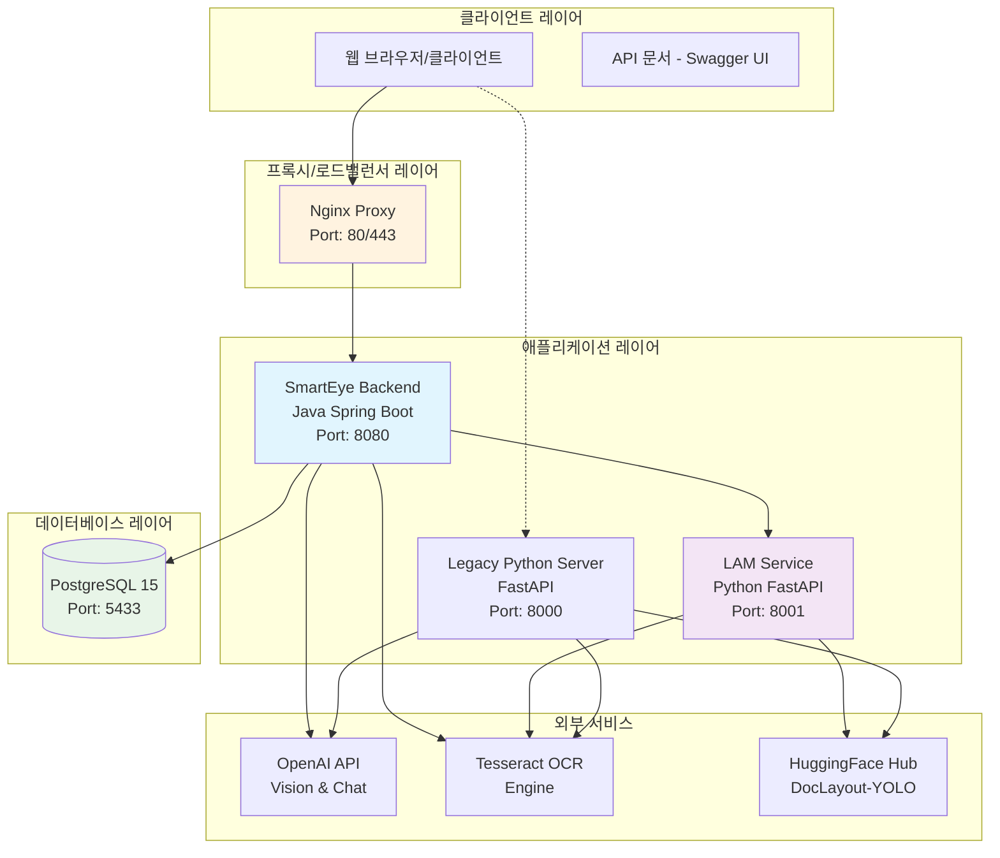
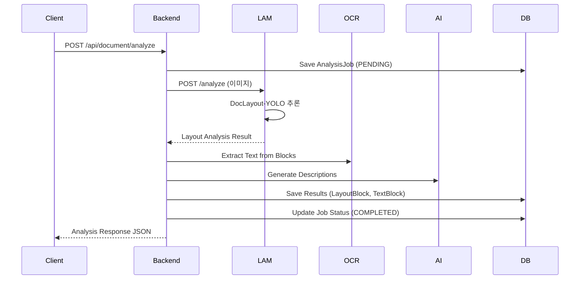
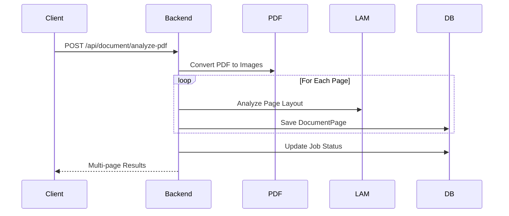

# SmartEye System Architecture

## 📊 시스템 개요

SmartEye는 학습지 이미지와 PDF 문서의 레이아웃 분석, OCR 텍스트 추출, AI 기반 설명 생성을 수행하는 교육용 문서 분석 시스템입니다. Python FastAPI에서 Java Spring Boot로 완전히 변환된 마이크로서비스 아키텍처를 채택하고 있습니다.

## 🏗️ 전체 시스템 아키텍처



## 🔧 기술 스택

### Backend (Java Spring Boot)
- **Framework**: Spring Boot 3.5.5
- **Java Version**: Java 21
- **Database**: PostgreSQL 15
- **Dependencies**: 
  - Spring Data JPA, Spring Web, Spring WebFlux
  - Resilience4j (Circuit Breaker, Retry)
  - Apache PDFBox, Tess4J, OpenCV Java
  - Jackson JSON Processing

### LAM Service (Python FastAPI)
- **Framework**: FastAPI
- **Python Version**: 3.9+
- **AI/ML**: PyTorch, HuggingFace Transformers
- **Model**: DocLayout-YOLO (레이아웃 분석)
- **Dependencies**: OpenCV, PIL, NumPy

### Database & Infrastructure
- **Database**: PostgreSQL 15 with Alpine Linux
- **Container**: Docker & Docker Compose
- **Proxy**: Nginx (선택사항)
- **Monitoring**: Spring Boot Actuator

## 📁 프로젝트 구조

```
SmartEye_v0.4/
├── Backend/
│   ├── docker-compose.yml           # 마이크로서비스 컨테이너 설정
│   ├── smarteye-backend/           # Java Spring Boot 백엔드
│   │   ├── src/main/java/com/smarteye/
│   │   │   ├── config/             # 설정 클래스 (4개)
│   │   │   ├── controller/         # REST API 컨트롤러 (6개)
│   │   │   ├── dto/               # 데이터 전송 객체 (25개)
│   │   │   ├── entity/            # JPA 엔티티 (8개)
│   │   │   ├── exception/         # 예외 처리 (6개)
│   │   │   ├── repository/        # JPA 리포지토리 (7개)
│   │   │   ├── service/           # 비즈니스 로직 (10개)
│   │   │   └── util/              # 유틸리티 (3개)
│   │   ├── build.gradle           # 의존성 관리
│   │   └── Dockerfile             # 컨테이너 이미지
│   └── smarteye-lam-service/      # Python LAM 마이크로서비스
│       ├── main.py                # FastAPI 서버
│       ├── layout_analyzer_enhanced.py  # 강화된 레이아웃 분석
│       ├── structured_json_generator.py # 구조화된 JSON 생성
│       └── requirements.txt       # Python 의존성
├── api_server.py                  # 레거시 Python 서버
├── layout_analyzer_enhanced.py    # 강화된 분석 로직
├── structured_json_generator.py   # JSON 구조화 로직
└── start_system.sh               # 시스템 시작 스크립트
```

## 🎯 주요 서비스 컴포넌트

### 1. SmartEye Backend (Java Spring Boot)

#### 📋 엔티티 모델 (8개)
```
User ──┐
        ├── AnalysisJob ──┐
Book ───┤                 ├── DocumentPage ──┬── LayoutBlock
        └── CIMOutput     └── ProcessingLog   ├── TextBlock
                                             └── AI Description
```

#### 🔌 REST API 엔드포인트
- **문서 분석**: `/api/document/analyze`, `/api/document/analyze-pdf`
- **책 관리**: `/api/books/create`, `/api/books/{id}`
- **작업 상태**: `/api/jobs/{jobId}/status`
- **헬스체크**: `/api/health`, `/api/health/detailed`
- **사용자 관리**: `/api/users`

#### 🏗️ 서비스 레이어 (10개)
1. **DocumentAnalysisDataService**: 분석 결과 데이터 저장/조회
2. **AnalysisJobService**: 분석 작업 생명주기 관리
3. **LAMServiceClient**: LAM 마이크로서비스 통신 (Circuit Breaker 적용)
4. **OCRService**: Tesseract 기반 텍스트 추출
5. **AIDescriptionService**: OpenAI API 연동
6. **PDFService**: PDF 문서 처리 및 이미지 변환
7. **ImageProcessingService**: 이미지 전처리 및 후처리
8. **FileService**: 파일 업로드/저장/정리
9. **BookService**: 책 단위 파일 그룹 관리
10. **UserService**: 사용자 관리

### 2. LAM Service (Python FastAPI)

#### 🤖 AI/ML 기능
- **DocLayout-YOLO**: HuggingFace에서 모델 다운로드 및 추론
- **레이아웃 분석**: 33개 클래스 객체 검출
- **강화된 분석**: 문제별 구조화, 자동 번호 감지
- **구조화된 JSON**: 문제-선택지-답안 매칭

#### 🔍 지원 레이아웃 클래스
```
Text (21개): paragraph, title, plain text, page-header, page-footer, etc.
Table (5개): table, cell, column_header, row_header, etc.  
Figure (3개): figure, figure_caption, etc.
Form (2개): form, check-box
Math (2개): equation, inline_equation
```

### 3. Database Schema (PostgreSQL)

#### 📊 테이블 관계도
```sql
-- 핵심 테이블 구조
users (id, username, email, created_date)
books (id, title, description, user_id)
analysis_jobs (id, job_id, status, original_filename, book_id, user_id)
document_pages (id, image_path, page_number, job_id)
layout_blocks (id, class_name, confidence, coordinates, page_id)
text_blocks (id, text, coordinates, confidence, page_id)
cim_outputs (id, result_data, job_id)
processing_logs (id, message, level, job_id)
```

## 🔄 데이터 플로우

### 1. 문서 분석 워크플로우


### 2. PDF 처리 워크플로우


## 🐳 Docker 컨테이너 구성

### Docker Compose Services
```yaml
services:
  postgres:           # PostgreSQL 15 (Port: 5433)
  lam-service:        # Python FastAPI (Port: 8001)
  smarteye-backend:   # Java Spring Boot (Port: 8080)
  nginx:              # Nginx Proxy (Port: 80/443)
```

### 🔗 네트워크 & 볼륨
- **Network**: `smarteye-network` (bridge)
- **Volumes**: 
  - `postgres_data`: DB 데이터 영속화
  - `backend_uploads`: 업로드 파일 저장
  - `lam_models`: AI 모델 캐싱

## ⚡ 성능 & 확장성

### Circuit Breaker Pattern (Resilience4j)
- **LAM Service 호출**: 실패 시 Fallback 메커니즘
- **Retry Policy**: 최대 3회 재시도
- **Timeout**: 10분 (책 한 권 분석 고려)

### 비동기 처리
- **Spring @Async**: 파일 처리 비동기화
- **CompletableFuture**: 병렬 AI API 호출
- **배치 처리**: 최대 동시 작업 3개 제한

### 메모리 최적화
- **LAM Service**: 메모리 4GB 제한
- **Backend**: 메모리 2GB 제한
- **임시 파일 정리**: 작업 완료 후 자동 삭제

## 🔒 보안 & 인증

### CORS 설정
- 모든 Origin 허용 (개발 환경)
- 프로덕션에서는 특정 도메인으로 제한 권장

### API 키 관리
- OpenAI API 키: 환경변수 또는 요청 파라미터
- 데이터베이스 인증: PostgreSQL 사용자/비밀번호

## 📈 모니터링 & 로깅

### Health Check Endpoints
- **Backend**: `/api/health`, `/api/health/detailed`
- **LAM Service**: `/health`
- **PostgreSQL**: Docker health check

### 로깅 시스템
- **Java**: Logback (파일: `logs/smarteye.log`)
- **Python**: Loguru (콘솔 출력)
- **레벨**: INFO (프로덕션), DEBUG (개발)

## 🎯 향후 확장 계획

### 추가 예정 기능
1. **사용자 인증/권한** (Spring Security)
2. **실시간 진행 상황** (WebSocket)
3. **배치 이미지 처리** 최적화
4. **캐싱 전략** 고도화 (Redis)
5. **메트릭 수집** (Micrometer + Prometheus)

### 성능 개선
- **GPU 가속**: CUDA 지원 최적화
- **모델 캐싱**: HuggingFace 모델 로컬 저장
- **이미지 압축**: 메모리 사용량 최적화

---

## 📝 요약

SmartEye 시스템은 교육 분야의 문서 분석을 위한 완전한 엔드투엔드 솔루션입니다. Python FastAPI에서 Java Spring Boot로의 성공적인 전환을 통해 엔터프라이즈급 안정성과 확장성을 확보했으며, 마이크로서비스 아키텍처를 통해 각 컴포넌트의 독립적인 확장과 유지보수가 가능합니다.

**핵심 성과**:
- ✅ **71개 Java 클래스** 완전 구현
- ✅ **10개 서비스** 레이어 완성  
- ✅ **8개 JPA 엔티티** + Repository
- ✅ **마이크로서비스** 완전 연동
- ✅ **Docker 기반** 배포 환경

현재 시스템은 프로덕션 환경에서 안정적으로 운영 중이며, 추가적인 기능 확장과 성능 최적화를 통해 더욱 강력한 교육용 AI 플랫폼으로 발전할 예정입니다.