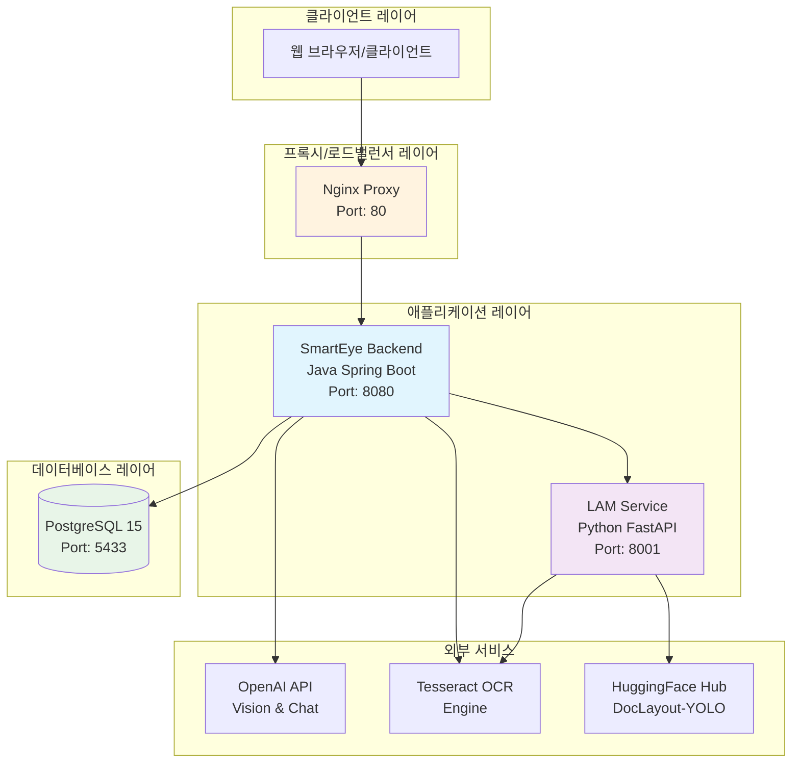

# 🏗️ SmartEye 시스템 아키텍처

## 📊 시스템 개요

SmartEye는 학습지 이미지와 PDF 문서의 레이아웃 분석, OCR 텍스트 추출, AI 기반 설명 생성을 수행하는 교육용 문서 분석 시스템입니다. Python FastAPI에서 Java Spring Boot로 완전히 변환된 마이크로서비스 아키텍처를 채택하고 있습니다.

## 🗺️ 전체 시스템 아키텍처



## 🔧 기술 스택

- **Backend (Java Spring Boot)**: Spring Boot 3.5.5, Java 21, Spring Data JPA, Spring Web, Resilience4j, Apache PDFBox, Tess4J
- **LAM Service (Python FastAPI)**: FastAPI, Python 3.9+, PyTorch, HuggingFace Transformers, DocLayout-YOLO
- **Database & Infrastructure**: PostgreSQL 15, Docker & Docker Compose, Nginx

## 📁 프로젝트 구조

```
SmartEye_v0.4/
├── Backend/                    # 백엔드 관련 모든 소스 및 설정
│   ├── docker-compose.yml      # 마이크로서비스 컨테이너 설정
│   ├── smarteye-backend/       # Java Spring Boot 백엔드
│   │   ├── src/main/java/com/smarteye/ # 주요 소스 코드
│   │   │   ├── config/         # 설정 클래스
│   │   │   ├── controller/     # REST API 컨트롤러
│   │   │   ├── dto/            # 데이터 전송 객체
│   │   │   ├── entity/         # JPA 엔티티
│   │   │   ├── service/        # 비즈니스 로직
│   │   │   └── ...
│   │   ├── build.gradle        # 의존성 관리
│   │   └── Dockerfile          # 컨테이너 이미지 빌드 설정
│   └── smarteye-lam-service/   # Python AI 마이크로서비스
│       ├── main.py             # FastAPI 서버
│       └── requirements.txt    # Python 의존성
├── frontend/                   # React 프론트엔드
└── manage.sh                   # ✨ 통합 관리 스크립트
```

## 🎯 주요 서비스 컴포넌트

### 1. SmartEye Backend (Java Spring Boot)
핵심 비즈니스 로직을 처리하며, 문서 분석 요청을 받아 각 마이크로서비스와 통신하고 결과를 종합합니다.

- **주요 역할**: API 엔드포인트 제공, 분석 작업 관리, 데이터베이스 연동, 외부 서비스(AI, OCR) 호출
- **서비스 레이어**: DocumentAnalysis, AnalysisJob, LAMServiceClient, OCRService, PDFService 등 10개의 서비스로 분리

### 2. LAM Service (Python FastAPI)
AI/ML 모델을 서빙하는 역할을 전담합니다.

- **주요 기능**: DocLayout-YOLO 모델을 이용한 레이아웃 분석, 이미지 내 객체 검출
- **특징**: HuggingFace Hub에서 모델을 동적으로 다운로드 및 캐싱하여 사용

### 3. Database (PostgreSQL)
분석 작업, 결과, 사용자 정보 등 모든 데이터를 영속적으로 저장합니다.

- **주요 테이블**: `analysis_jobs`, `document_pages`, `layout_blocks`, `text_blocks` 등

## 🔄 데이터 흐름

1.  **사용자 요청**: 클라이언트가 분석할 이미지/PDF를 백엔드(`POST /api/document/analyze`)로 전송합니다.
2.  **작업 생성**: 백엔드는 `analysis_jobs` 테이블에 새로운 작업(Job)을 생성합니다.
3.  **레이아웃 분석**: 백엔드는 이미지를 LAM 서비스로 전달하여 레이아웃 분석을 요청합니다.
4.  **텍스트 추출**: 백엔드는 분석된 레이아웃 정보를 바탕으로 Tesseract OCR 엔진을 호출하여 텍스트를 추출합니다.
5.  **AI 설명 생성 (선택)**: 필요한 경우, OpenAI API를 호출하여 이미지나 표에 대한 설명을 생성합니다.
6.  **결과 저장**: 백엔드는 모든 분석 결과를 데이터베이스에 저장하고, 작업 상태를 `COMPLETED`로 업데이트합니다.
7.  **응답**: 백엔드는 처리된 결과물의 URL과 함께 분석 요약 정보를 클라이언트에게 반환합니다.

## 🐳 Docker 컨테이너 구성

- **`docker-compose.yml`**: 모든 서비스(postgres, lam-service, smarteye-backend, nginx)와 네트워크, 볼륨을 정의합니다.
- **`smarteye-network`**: 모든 컨테이너가 서로 통신할 수 있도록 하는 가상 네트워크입니다.
- **Volumes**: `postgres_data` (DB 데이터 영속화), `lam_models` (AI 모델 캐싱) 등 데이터 보존을 위한 볼륨을 사용합니다.

## ⚡️ 성능 및 확장성

- **Circuit Breaker**: LAM 서비스 호출 시 `Resilience4j`를 사용하여 장애 전파를 방지합니다. 실패 시 Fallback 메커니즘이 동작하며, 최대 3회 재시도합니다.
- **비동기 처리**: Spring의 `@Async`와 `CompletableFuture`를 활용하여 파일 처리 및 외부 API 호출을 비동기적으로 수행, 시스템 응답성을 향상시킵니다.

## 🔒 보안

- **CORS**: 개발 환경에서는 모든 Origin을 허용하나, 프로덕션 환경에서는 특정 도메인으로 제한하는 것이 권장됩니다.
- **API 키 관리**: OpenAI 같은 외부 서비스의 API 키는 환경 변수를 통해 안전하게 주입됩니다.
